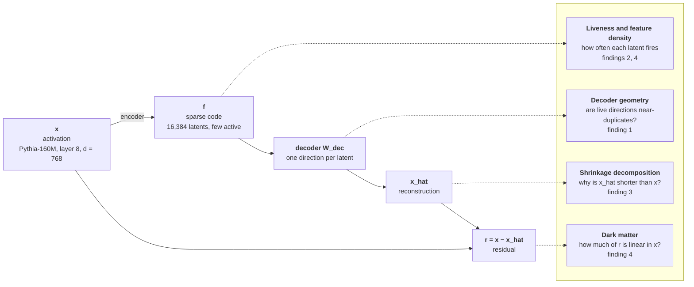
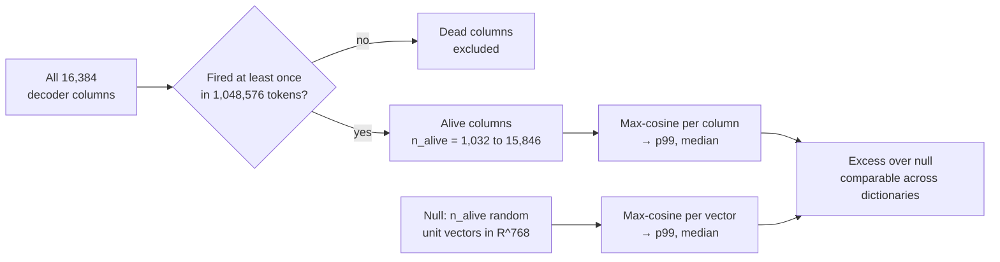
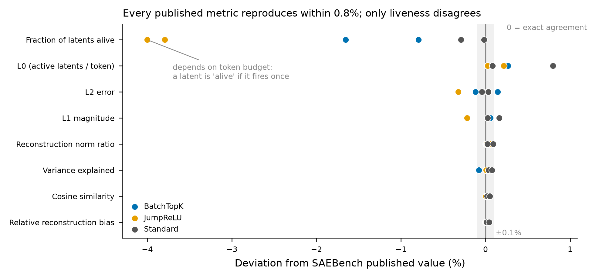
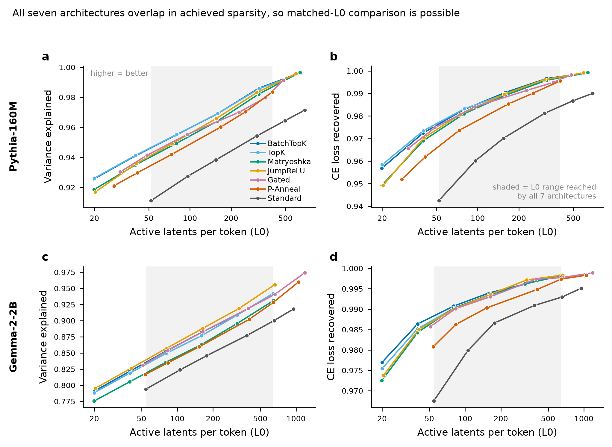
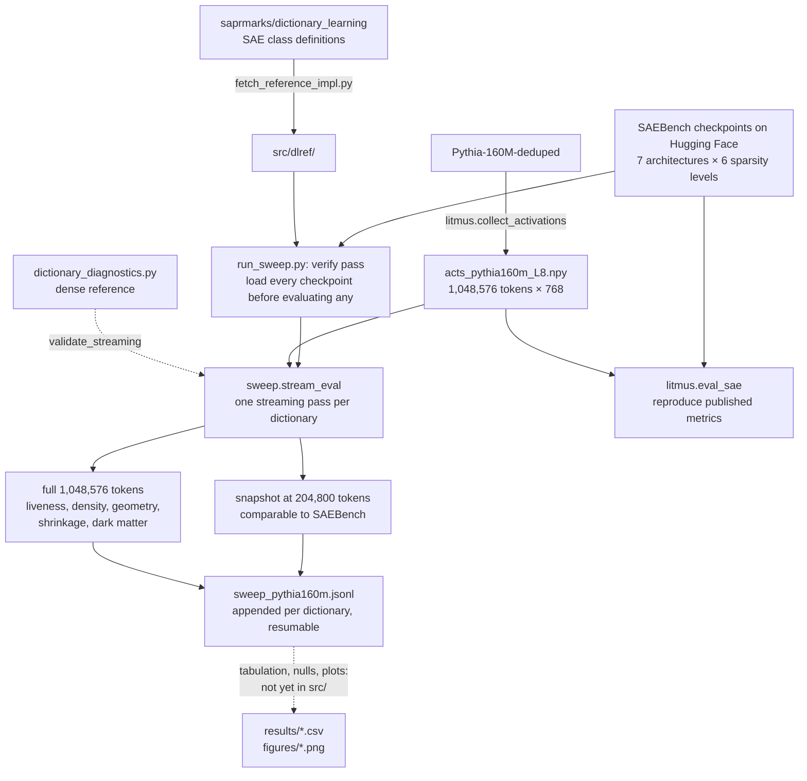

# SAE dictionary diagnostics

Diagnostics for sparse autoencoder dictionaries that go beyond reconstruction and
sparsity: a shrinkage decomposition, a dark-matter residual analysis, alive-masked
decoder geometry with size-matched nulls, and feature-density statistics. Run on the
public [SAEBench](https://github.com/adamkarvonen/SAEBench) checkpoint suites.

The point is not another leaderboard. Three statistics in common use turn out to be
confounded in ways that change conclusions, and this repository contains the evidence
and the corrected estimators.

**Status: work in progress.** The sweep is partial — see [Current state](#current-state).
Numbers below are as of this commit and are reproducible from the code and tables here.

---

## What is being measured

A sparse autoencoder (SAE) rewrites a model's internal activation `x` as a sparse
combination of learned directions — the columns of its decoder — and reconstructs it as
`x_hat`. Each diagnostic here looks at a different part of that process:



---

## Findings

### 1. Decoder max-cosine over all columns is a mixture statistic

The standard way to ask "does this dictionary contain near-duplicate features" is to
compute, for each decoder column, the maximum cosine similarity to any other column, and
report a percentile. Computed over **all** columns this conflates live features with dead
ones, and dictionaries differ enormously in how many latents are dead — from 3% to 94%
in this sweep alone.

Restricting the statistic to latents that actually fire moves the 99th percentile by
**−0.258 to +0.220**, and it moves in *opposite directions depending on architecture*:

- **up** for BatchTopK, whose dead columns sit near initialisation (so removing them
  raises the percentile)
- **down** for Gated, whose dead columns are near-duplicates *of each other* (so removing
  them lowers it)

That asymmetry is itself a result: the two architectures fail differently in the unused
part of the dictionary.

The correction changes a conclusion, not just a number. On the two complete sparsity
ladders, the uncorrected statistic says Gated carries far more near-duplicate directions
than BatchTopK at every operating point. Corrected and null-subtracted, Gated exceeds
BatchTopK only above L0 ≈ 150, and is *lower* below it:

| matched L0 | 30.9 | 48.8 | 77.2 | 122.1 | 193.2 | 305.5 | 483.0 |
|---|---|---|---|---|---|---|---|
| Gated − BatchTopK, excess p99 over null | −0.029 | −0.038 | −0.058 | −0.026 | +0.054 | +0.112 | +0.316 |

The uncorrected version overstated the loose-end gap by roughly 1.8–3× and had the wrong
sign at the tight end.

**A size-matched null is also required**, because max-cosine depends on how many vectors
are in the population, and `n_alive` ranges from 1,032 to 15,846 here. For random unit
vectors in R^768 the max-cosine p99 is 0.1516 at N=1,032 rising to 0.1724 at N=15,846
(median 0.1146 to 0.1408). The spread is small enough to be immaterial for p99
comparisons but decisive for the median: BatchTopK at L0 ≈ 639 has an alive-masked median
of 0.1112 against a null of 0.1146, meaning its 1,032 surviving directions are **no more
clustered than chance**.

The corrected statistic, end to end:



### 2. Liveness is a statistic of the token budget, not a property of the dictionary

A latent counts as "alive" if it fires at least once, so the fraction alive is monotone in
the number of tokens evaluated. For one checkpoint, against SAEBench's published value of
0.933838:

| token budget | fraction alive | deviation |
|---|---|---|
| 204,800 | 0.93140 | −0.261% |
| 1,048,576 | 0.96716 | +3.569% |

The deviation **changes sign** across SAEBench's declared budget of 200 contexts × 1024,
which pins their effective evaluation budget at ≈204,800 rather than merely being
consistent with it — a quantity documented nowhere in their artifacts. Across the sweep,
every dictionary gains alive latents at the larger budget, by +0.94% to +10.41%.

Over the same 5× change in tokens, L0, variance explained and cosine similarity move by
at most 0.11%. The sensitivity is specific to liveness.

**Practical consequence:** a dead-feature or liveness number without its token count
attached is not interpretable, and two such numbers from different papers are not
comparable.

### 3. Reconstruction shortfall is an additive offset, not multiplicative shrinkage

SAE reconstructions are systematically short — the norm ratio ‖x̂‖/‖x‖ runs 0.951 to
0.998 here. The common reading is that the decoder under-scales, and the common fix is to
rescale it. Both are wrong at these operating points.

- The optimal single scalar gain γ\* stays within **[0.9991, 1.0016]**
- Applying it recovers at most **6.8 × 10⁻³ %** of the FVU that exists
- Yet norms really are short

The slope/intercept decomposition resolves the apparent contradiction: regressing ‖x̂‖ on
‖x‖ gives a slope at or slightly *above* 1 with an intercept of **−5.62% to −0.35% of
mean ‖x‖**. The deficit is an additive offset, and no scalar gain removes an additive
offset.

Note that γ\* alone is uninformative: it is the reciprocal of the
`relative_reconstruction_bias` field SAEBench already publishes. The decomposition is
what carries the information.

### 4. Nominal width is not effective width

BatchTopK dead fractions across its sparsity ladder, at 1,048,576 tokens:

| L0 | 19.9 | 39.8 | 79.6 | 159.0 | 318.5 | 638.9 |
|---|---|---|---|---|---|---|
| dead fraction | 0.033 | 0.065 | 0.117 | 0.238 | 0.667 | 0.937 |

At L0 ≈ 639 only **1,032 of 16,384** latents ever fire. "Width 2^14" describes the
parameter count, not the dictionary. Dark-matter R² falls in step — 0.374 → 0.039 — so
the residual becomes less linearly recoverable as reconstruction improves, but at the
sparse end **over a third of what the SAE fails to reconstruct is still linearly
predictable from the input activation itself**.

---

## Validation

The evaluator reproduces SAEBench's own published metrics on their own checkpoints.
Maximum absolute deviation across 6 Pythia-160M checkpoints spanning three different
state-dict conventions:

| metric | max \|deviation\| |
|---|---|
| relative reconstruction bias | 0.045% |
| cosine similarity | 0.049% |
| fraction of variance explained | 0.080% |
| L2 norm ratio | 0.088% |
| L1 loss | 0.218% |
| L2 loss | 0.324% |
| L0 | 0.797% |
| fraction of latents alive | 4.003% |

Seven of eight agree within 0.8%. The eighth is finding 2.



Two further guards are in the code rather than the prose:

- `sweep.validate_streaming` checks the streaming/algebraic implementation against a
  dense reference implementation on every shared key, and fails on disagreement beyond a
  tight relative tolerance. The streaming rewrite exists because a dense latent matrix at
  16,384 × 1M tokens is 65 GB; the risk it introduces is that a sign error in a centring
  term produces a plausible number and no exception, which is what this gate is for.
- `run_sweep.py` runs a fail-fast pass that constructs and loads every checkpoint before
  evaluating any, so an architecture/class mismatch surfaces in minutes rather than hours
  in.

---

## Current state

16 of 42 dictionaries evaluated at the primary configuration — Pythia-160M-deduped,
`resid_post_layer_8`, width 2^14, 7 architectures × 6 sparsity levels. Complete sparsity
ladders for BatchTopK and Gated; JumpReLU in progress.

The seven architectures reach overlapping sparsity ranges, which is what makes comparing
them at matched L0 possible (shaded band):



The sweep is resumable: `run_sweep.py` reads back completed units from the JSONL and
skips them, so an interrupted run loses only the dictionary in flight.

---

## Pipeline



---

## Layout

```
src/
  sweep.py                    streaming evaluator; sufficient statistics only
  run_sweep.py                resumable driver (verify pass, then evaluate)
  litmus.py                   reproduction harness against published values
  dictionary_diagnostics.py   dense reference implementations + decoder geometry
  fetch_reference_impl.py     fetches third-party SAE classes (see Provenance)
results/
  sweep_pythia160m.csv        16 dicts x 2 token budgets x 47 columns
  litmus_reproduction.csv     per-metric reproduction of published values
  geometry_null_corrected.csv alive-masked geometry with size-matched nulls
  operating_points.csv        SAEBench published operating points, both scales
  matched_l0_curves.csv       interpolated onto a common log-L0 grid
  ranking_summary.csv         architecture ranks across the sparsity window
  saebench_manifest.csv       checkpoint inventory
  compute_benchmark.csv       fitted fixed/per-token cost coefficients
  feature_density_hists.json  per-dictionary log10 firing-frequency histograms
figures/
  validation_reproduction.png reproduction deviation by metric
  operating_points.png        published operating points, both model scales
  rank_structure.png          architecture rank against matched sparsity
```

---

## Running it

```bash
pip install -r requirements.txt
python src/fetch_reference_impl.py        # third-party SAE classes, see Provenance
python src/litmus.py                      # reproduce published values (~20 min CPU)
python src/run_sweep.py pythia-160m       # full sweep; add a number to stop early
```

The sweep needs an activation buffer at `acts_pythia160m_L8.npy` (1,048,576 tokens ×
768 dims, float32, 3.2 GB). It is not in the repository — it is regenerable, and the
collection code is in `litmus.collect_activations`. On 16 CPU cores, collection takes
about 32 minutes and each dictionary about 5 minutes.

Measured cost coefficients, for planning other configurations — the cost decomposes into
a fixed term (decoder geometry, O(d_sae² · d_model), independent of token count) and a
per-token term:

| configuration | fixed | per 1k tokens | min/dict at 1M tokens |
|---|---|---|---|
| d=768, w=2^12 | 0.3 s | 0.10 s | 1.7 |
| d=768, w=2^14 | 3.7 s | 0.34 s | 6.0 |
| d=768, w=2^16 | 63.6 s | 1.03 s | 19.0 |
| d=2304, w=2^14 | 9.8 s | 0.78 s | 13.8 |

Fitted scaling: geometry ~ d_sae^1.87 · d_model^0.86; per-token ~ d_sae^0.85 ·
d_model^0.76.

---

## Provenance of third-party code

The SAE classes needed to load SAEBench checkpoints come from
[saprmarks/dictionary_learning](https://github.com/saprmarks/dictionary_learning). They
are **not vendored here** — `src/fetch_reference_impl.py` downloads them at setup time,
so this repository's MIT licence covers only its own code and that project's licence
governs theirs.

One pitfall worth recording, because it fails silently. SAELens ships a
`dictionary_learning_1` checkpoint converter, which looks like the obvious way to load
these checkpoints. It maps only `AutoEncoderTopK` and `GatedAutoEncoder` to their true
architectures; everything else falls through to plain ReLU. For BatchTopK, JumpReLU and
Matryoshka checkpoints that means the learned threshold is ignored — no error, plausible
output, wrong sparsity. Hence the fetch-the-real-classes approach, and hence the
fail-fast load pass in `run_sweep.py`.

**Reproducibility gap, stated rather than papered over:** the fetch script is not pinned
to an upstream commit. It was written against the repository state at the time of this
work and the URLs are not verified in this commit. Pin a commit SHA before relying on it.

---

## Known limitations

- **Single layer.** Every result here is from `resid_post_layer_8` of one 160M-parameter
  model. All three SAEBench Pythia widths and both Gemma releases are single-layer, so
  nothing here is known to be anything other than a layer-8 property. Closing this needs
  Gemma Scope (26 layers) or Llama Scope (32 layers), neither of which is
  architecture-matched.
- **Sample convergence unchecked.** The shrinkage and dark-matter estimators are the
  sample-hungry ones and have not been shown converged at 1M tokens. A 4.2M-token check
  on a subset is planned.
- **No GPU has been used.** Every timing here is CPU. The streaming evaluator accumulates
  in float64, which does not obviously port well to a GPU.
- **Findings 1 and 3 rest on three architectures** (BatchTopK, Gated, and partial
  JumpReLU) pending completion of the sweep.
- **Attribution of current practice is not yet done.** The claim that these statistics are
  "in common use" needs specific citations to specific papers and codebases, which are
  not in this repository yet and must not be assumed.

---

## Licence

MIT — see [LICENSE](LICENSE).

Third-party code fetched by `src/fetch_reference_impl.py` is governed by its own licence.
Checkpoints and published metrics are from SAEBench and Gemma Scope and carry their
respective licences; none are redistributed here.
